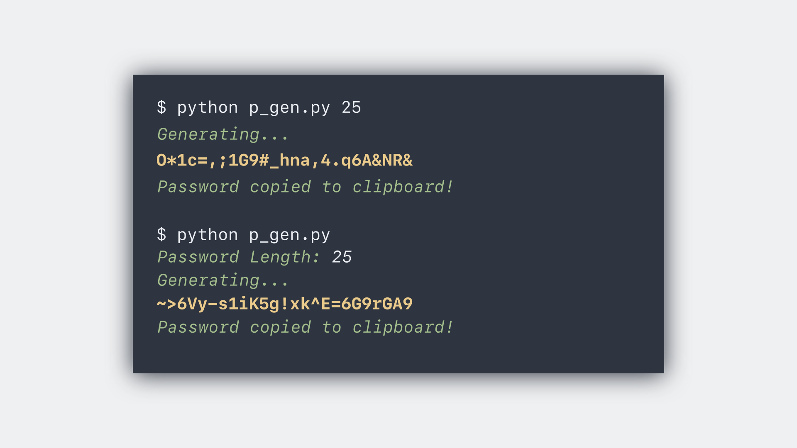

# Password Generator

Script to generate a password of a given length and copy it to the clipboard.

### Instructions

1) Install **pyperclip** using:
    
       pip install pyperclip

2) Clone this repo

3) cd into *password_generator* directory using:

       cd password_generator

4) To run the password generator, enter the following in the terminal: 

       python password_generator.py {password_length_here}
    
   or just enter:
   
       python password_generator.py
    
### To Do

- [x] ~~Add CLI Support~~
    

